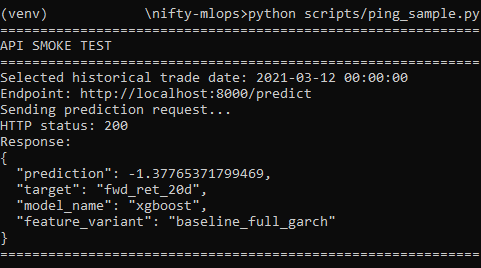
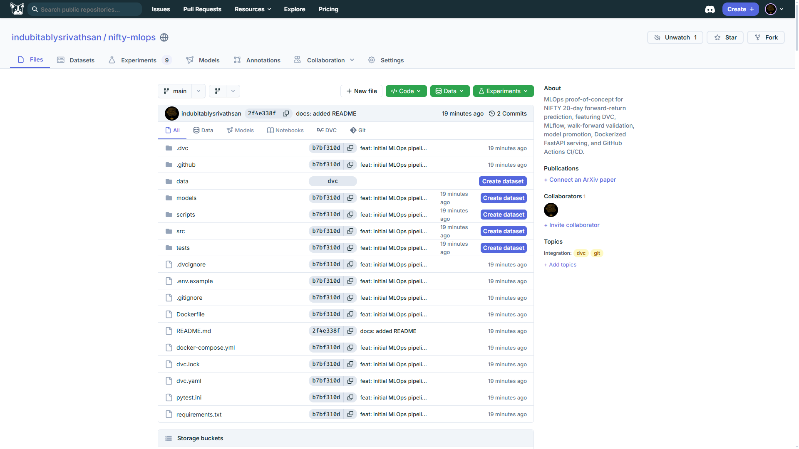
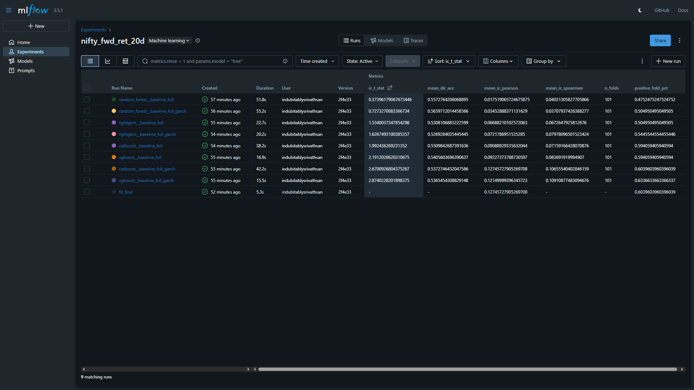
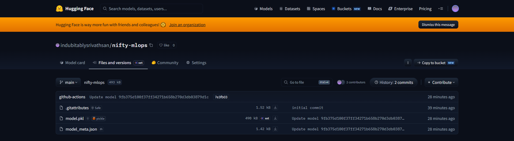
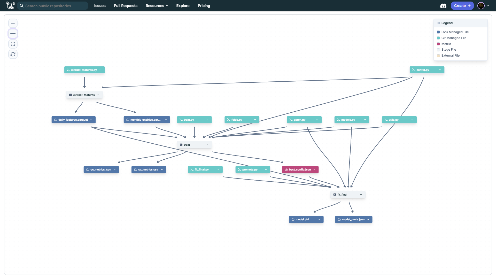
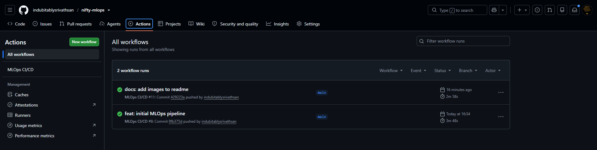

# nifty-mlops

An end-to-end MLOps pipeline that predicts NIFTY 50's 20-trading-day forward
return (`fwd_ret_20d`) from options, futures, and participant-flow data —
walk-forward cross-validated, tracked in MLflow, versioned with DVC, gated
by an explicit promotion policy, served over FastAPI, containerized, and
deployed automatically via GitHub Actions.

This repo does not scrape or host the raw market data itself. The feature
set is derived from **[candL](https://github.com/indubitablysrivathsan/candL)**,
a self-hosted NSE market-analytics project that pulls end-of-day data
directly from NSE's public archives into a local DuckDB database
(`nse.db`). See [Dataset Generation](#dataset-generation) below.

---

## Project Features

### FastAPI Prediction API



### DagsHub Repository



### MLflow Experiments



### Hugging Face Model Registry



### DVC Data Tracking



### GitHub Actions CI/CD



The complete pipeline is versioned, tracked, and reproducible across DVC,
DagsHub/MLflow, and Hugging Face.

---

## Architecture

```
                    ┌────────────────────┐
                    │   nse.db (candL)   │   ← not included, see Dataset Generation
                    └─────────┬──────────┘
                              │  extract_features.py
                              ▼
                 data/processed/daily_features.parquet   (DVC-tracked)
                              │
                              │  train.py
                              ▼
              Walk-forward CV — 4 models × 2 feature variants
                   (logged to MLflow as experiment runs)
                              │
                              ▼
                   models/best_config.json (winning config)
                              │
                              │  fit_final.py
                              ▼
                     promotion gate (src/promote.py)
                   ┌──────────┴──────────┐
              FAILS │                    │ PASSES
                    ▼                    ▼
        no artifact exported    refit on ALL historical data
        run stays experiment-only        │
                                          ▼
                          models/model.pkl + model_meta.json
                          (DVC-tracked; registered + promoted
                           to "Production" in MLflow Registry)
                                          │
                                          ▼
                          FastAPI (src/app.py) loads model.pkl
                                          │
                                          ▼
                     Docker image → docker-compose smoke test
                                          │
                                          ▼
                     GitHub Actions deploy job (main branch only,
                     only if dvc.lock's model changed) pushes the
                     promoted artifact to a Hugging Face model repo
```

No training happens inside CI or inside the Docker image. `train.py` and
`fit_final.py` are run offline (locally or as a scheduled job); CI only
tests, pulls the already-promoted artifact via `dvc pull`, builds the
image, and redeploys.

---

## Repository structure

```
nifty-mlops/
├── src/
│   ├── config.py            # single source of truth: paths, feature groups,
│   │                         #   model hyperparams, fold params, promotion thresholds
│   ├── extract_features.py  # nse.db -> data/processed/daily_features.parquet
│   │                         #   (+ monthly_expiries.parquet for fold boundaries)
│   ├── folds.py              # expiry-aligned walk-forward fold construction
│   ├── garch.py               # per-fold GARCH(1,1) volatility feature
│   ├── models.py               # model factory: RF / XGBoost / LightGBM / CatBoost
│   ├── utils.py                 # IC metrics, model_df loading/prep
│   ├── train.py                  # walk-forward CV + MLflow experiment tracking
│   ├── promote.py                 # promotion gate (see below)
│   ├── fit_final.py                # refit winner on full history + MLflow registry push
│   ├── predict.py                   # loads model.pkl, exposes predict_one()
│   └── app.py                        # FastAPI service (/health, /features, /predict)
│
├── scripts/
│   └── ping_sample.py        # samples a real historical row and POSTs it to /predict
│
├── tests/                    # pytest — folds, IC metrics, promotion gate, API contract
│
├── data/
│   ├── raw/                  # nse.db goes here (gitignored, not DVC-tracked)
│   └── processed/            # daily_features.parquet, monthly_expiries.parquet (DVC-tracked)
│
├── models/                   # best_config.json, cv_metrics.{json,csv}, model.pkl,
│                              #   model_meta.json (DVC-tracked outputs of the pipeline)
│
├── dvc.yaml / dvc.lock       # 3-stage DVC pipeline: extract_features → train → fit_final
├── .dvc/config                # DVC remote: DagsHub S3-compatible storage
├── Dockerfile
├── docker-compose.yml
├── .github/workflows/ci-cd.yml
├── .env.example
├── pytest.ini
└── requirements.txt
```

---

## Dataset Generation

The raw market database (`nse.db`) is **not included in this repository**
because of its size and because it's maintained as an independent project.
It comes from **candL**: https://github.com/indubitablysrivathsan/candL

candL runs its own sync pipeline against NSE's public archives (F&O
bhavcopy, equity bhavcopy, FII statistics, participant OI/volume, EWMA
volatility, market activity) and lands everything in a local DuckDB file.

To reproduce the dataset used by this project:

1. Clone and run candL to build (or update) `nse.db`:
   ```bash
   git clone https://github.com/indubitablysrivathsan/candL.git
   cd candL
   pip install -r requirements.txt
   # set SYNC_START_DATE in config.py, then run the backend once to sync
   uvicorn api.main:app --host 127.0.0.1 --port 8000
   ```
2. Point this repo at the resulting database via `.env`:
   ```env
   NSE_DB_PATH=/path/to/candL/data/nse.db
   ```
3. Extract the feature snapshot this pipeline actually trains on:
   ```bash
   python -m src.extract_features
   ```
   This writes `data/processed/daily_features.parquet` (the joined,
   engineered daily feature table for NIFTY 50) and
   `data/processed/monthly_expiries.parquet` (expiry boundaries used to
   build walk-forward folds). Both are DVC-tracked from this point on —
   nothing downstream of this script ever touches `nse.db` again.

---

## Feature set

Features are grouped in `src/config.py::FEATURE_GROUPS`, spanning:

- **price_vol** — index level, India VIX, realized volatility (underlying/futures/applicable)
- **options_derived** — PCR, max-pain distance, basis, cost of carry, futures OI change %
- **breadth** — advances/declines, AD ratio, price-band hits, traded value, market cap
- **fii_dii_positioning** — FII/DII/Client/Pro net futures %, FII net flow, FII PE net %
- **options_skew** — FII/Client/DII/Pro options call-put skew %
- **vol_futures_flow** — volume-based futures net % by participant
- **divergence_stats** — FII–client divergence, FII stats net %/OI
- **engineered_deltas** — 5-day changes in VIX, PCR, basis, max-pain distance, FII flow

Three columns (`nifty_close`, `market_cap_cr`, `num_trades`) are excluded
from the model feature set as identified level/trend confounds. Two
feature-set variants are trained per model:

| Variant | Features |
|---|---|
| `baseline_full` | all groups above |
| `baseline_full_garch` | all groups above + `garch_sigma`, `garch_sigma_chg` |

`garch_sigma` / `garch_sigma_chg` come from a GARCH(1,1) (Student-*t*
innovations) fit strictly on that fold's training returns, forecast
forward over the test window — never re-fit on test data.

---

## Walk-forward validation

Folds are aligned to NIFTY monthly expiry boundaries rather than arbitrary
calendar splits (`src/folds.py`):

- Train up to expiry *i*, **minus a 20-day embargo** (matched to the
  20-day prediction horizon) to purge train/test label overlap.
- Test from expiry *i* to expiry *i+1*.
- Requires at least 24 expiries (~2 years) of history before the first
  fold, and a minimum of 100 training rows / 5 test rows per fold.

## Models trained

Four model families, fixed hyperparameters (no per-fold tuning), two
feature variants each — **8 experiments per `train.py` run** (`src/models.py`,
`src/config.py::MODEL_PARAMS`):

| Model | Key hyperparameters |
|---|---|
| Random Forest | 300 trees, max_depth=4, min_samples_leaf=20 |
| XGBoost | 300 rounds, max_depth=4, lr=0.03, L1/L2 reg, 0.8 subsample |
| LightGBM | 300 rounds, max_depth=4, lr=0.03, L1/L2 reg, 0.8 subsample |
| CatBoost | 300 iterations, depth=4, lr=0.03, L2 reg, 0.8 subsample |

Each experiment is logged as its own MLflow run (params, per-fold and
summary metrics, a fold-results CSV artifact). `train.py` writes:

- `models/cv_metrics.json` / `models/cv_metrics.csv` — every experiment's summary
- `models/best_config.json` — the winning `{model, feature_variant, feature_cols}`,
  tracked as a DVC **metric** file

---

## Promotion gate

`src/promote.py` decides whether the winning config from `train.py` is
allowed to become the new production model. **All** of the following must
hold:

1. Walk-forward evaluation completed (fold count > 0).
2. `mean_ic_pearson ≥ PROMOTION_MIN_MEAN_IC` (default **0.05**).
3. `positive_fold_pct ≥ PROMOTION_MIN_POSITIVE_FOLD_PCT` (default **0.55**).
4. Not worse than the current MLflow-registered **Production** model's
   `mean_ic_pearson` by more than `PROMOTION_REGRESSION_TOLERANCE`
   (default **0.0**, i.e. must be at least as good). If there is no
   current Production model yet, this condition passes automatically.

If the gate fails, `fit_final.py` exits non-zero without writing
`model.pkl` — the run stays an MLflow experiment only, and whatever is
currently in Production is left untouched. If it passes, `fit_final.py`:

1. Refits the winning model on **all** historical data (not just the
   walk-forward training folds).
2. Writes `models/model.pkl` + `models/model_meta.json`.
3. Registers the model in the MLflow Model Registry
   (`MLFLOW_REGISTRY_MODEL_NAME`) and transitions it to the
   **Production** stage, archiving the previous version.

All thresholds are configurable via environment variables (see
`.env.example`).

---

## Running the pipeline locally

```bash
pip install -r requirements.txt
cp .env.example .env   # set NSE_DB_PATH and any threshold overrides

python -m src.extract_features   # nse.db -> daily_features.parquet
python -m src.train                # walk-forward CV, 8 experiments, MLflow logging
python -m src.fit_final             # promotion gate -> refit -> registry push
```

Or via DVC, which tracks each stage's dependencies/outputs and skips
anything unchanged:

```bash
dvc repro
```

Inspect experiments with the MLflow UI:

**MLflow UI** : https://dagshub.com/indubitablysrivathsan/nifty-mlops.mlflow

---

## Serving

```bash
uvicorn src.app:app --host 0.0.0.0 --port 8000
```

Endpoints:

| Endpoint | Description |
|---|---|
| `GET /health` | Model-loaded status, current model name/feature variant |
| `GET /features` | The exact feature names the loaded model expects |
| `POST /predict` | Accepts a JSON body of feature values, returns the predicted `fwd_ret_20d` |

If the loaded model uses the GARCH variant, `garch_sigma` /
`garch_sigma_chg` don't need to be supplied — `ModelPredictor` fits
GARCH(1,1) once at startup from the bundled `daily_features.parquet`
history and uses the latest available volatility state. This means the
served GARCH feature is only as fresh as the last `extract_features.py`
run baked into the image; refreshing it requires rebuilding the image
against an updated feature snapshot, not a per-request recomputation.

Try it against a real historical row:

```bash
python scripts/ping_sample.py
```

This samples a random row from `data/processed/daily_features.parquet`
with all required features present and POSTs it to `/predict`.

---

## Docker

```bash
# model.pkl must already exist (dvc repro, or dvc pull) before building —
# this image serves, it does not train.
docker compose up --build
curl http://localhost:8000/health
```

The image bundles `src/`, `models/`, and
`data/processed/daily_features.parquet` (needed for the GARCH fit
described above). It does **not** bundle `nse.db` or run
`extract_features.py`/`train.py`/`fit_final.py`.

---

## DVC + remote storage

`dvc.yaml` defines three stages — `extract_features`, `train`,
`fit_final` — each with explicit `deps`/`outs`, so `dvc repro` only
re-runs what actually changed. The configured remote
(`.dvc/config`) is DagsHub S3-compatible storage:

```ini
[core]
    remote = origin
['remote "origin"']
    url = s3://dvc
    endpointurl = https://dagshub.com/indubitablysrivathsan/nifty-mlops.s3
```

`dvc push` / `dvc pull` use this remote. In CI, credentials come from the
`DAGSHUB_TOKEN` repository secret.

---

## CI/CD

`.github/workflows/ci-cd.yml` — two jobs:

**`test`** (every PR and push to `main`):
checkout → set up Python 3.11 → `pip install -r requirements.txt` →
`pytest tests/ -v`.

**`deploy`** (push to `main` only, after `test` passes):

1. Configure the DVC remote with `DAGSHUB_TOKEN`.
2. Diff `dvc.lock` against the previous commit — if the model artifact
   didn't change, deployment is skipped entirely.
3. If it did change: `dvc pull` the promoted `model.pkl` /
   `model_meta.json` / `daily_features.parquet`, verify they exist,
   `docker compose up -d --build`, poll `/health` until it's up, print
   container logs, then `docker compose down`.
4. Push the promoted `model.pkl` + `model_meta.json` to a Hugging Face
   model repo (`HF_REPO_ID`, authenticated via `HF_TOKEN`) as the
   external hosting/distribution point for the artifact.

No model is trained anywhere in this workflow — it only ever tests,
pulls, containerizes, smoke-tests, and republishes whatever
`fit_final.py` already promoted locally/offline.

---

## Testing

```bash
pytest tests/ -v
```

Covers: walk-forward fold construction (no train/test overlap, no
look-ahead past the embargo, minimum-size fold rejection), IC/summary
metrics, the promotion gate's four conditions independently, and the
`/health` + `/predict` FastAPI contract against a fixture model.

---

## Environment variables

See `.env.example` for the full list. Key ones:

| Variable | Purpose |
|---|---|
| `NSE_DB_PATH` | Path to candL's `nse.db` — only used by `extract_features.py` |
| `MLFLOW_TRACKING_URI` | DagsHub-hosted MLflow tracking server |
| `MLFLOW_EXPERIMENT_NAME` / `MLFLOW_REGISTRY_MODEL_NAME` | MLflow experiment + registry naming |
| `PROMOTION_MIN_MEAN_IC` / `PROMOTION_MIN_POSITIVE_FOLD_PCT` / `PROMOTION_REGRESSION_TOLERANCE` | Promotion gate thresholds |

CI/CD-only secrets (not in `.env`): `DAGSHUB_TOKEN`, `HF_TOKEN`, `HF_REPO_ID`.

---

## Known limitations

- **Small effective sample.** Walk-forward evaluation on ~8 years of
  20-trading-day-horizon data yields a limited number of independent
  folds; treat `mean_ic_pearson` as a noisy estimate, not a guarantee.
- **No live GARCH recomputation.** As noted above, the served
  `garch_sigma` feature reflects whatever history was baked into the
  image at build time, not the latest trading day, unless the image is
  rebuilt against a fresh `daily_features.parquet`.
- **Cost/execution modeling lives outside this repo.** This pipeline
  produces a point prediction of `fwd_ret_20d`; it does not size
  positions, apply transaction costs, or backtest a trading strategy —
  see the accompanying research working paper for that analysis and its
  own caveats (threshold selection, drawdown behavior, etc.).

---

## Credits

- Market data pipeline: **[candL](https://github.com/indubitablysrivathsan/candL)**
  (NSE public archives → DuckDB).
- Models: scikit-learn, XGBoost, LightGBM, CatBoost.
- Experiment tracking / registry: MLflow.
- Data + model versioning: DVC, remote storage on DagsHub.
- Serving: FastAPI, Docker.
- CI/CD: GitHub Actions, with promoted artifacts mirrored to Hugging Face.
